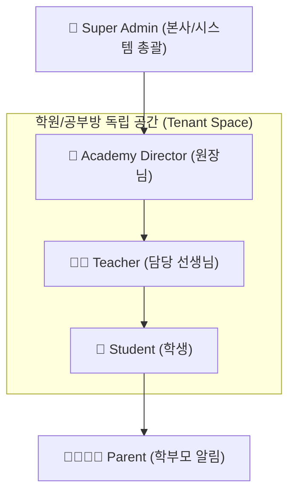
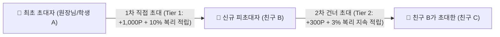
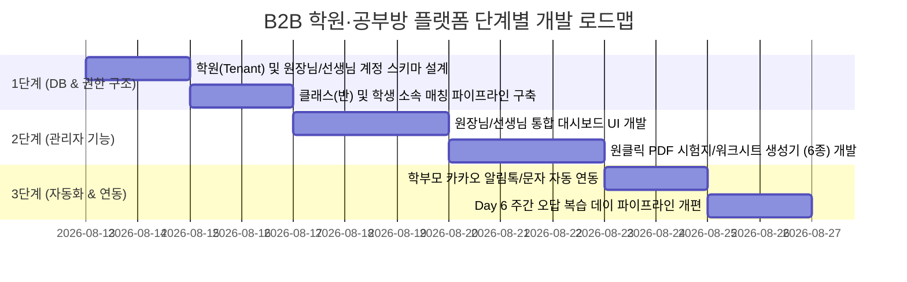

# 📑 [Steve Voca] 학원·공부방 B2B SaaS 통합 기획서 (Product Specification)

> **프로젝트명**: Steve Voca B2B (학원·공부방 원장님 & 선생님 전용 스마트 영단어 관리 플랫폼)  
> **목적**: 기존 학생 전용 학습 앱을 학원, 공부방, 교습소에 B2B 상용 서비스로 확장하여 **원장님, 담당 선생님, 학생, 학부모**가 유기적으로 연동되는 학생 맞춤형 스마트 단어 관리 시스템 구축

---

## 1. 👥 다중 테넌트(Multi-Tenant) 권한 및 역할 체계



### 1.1. 권한별 상세 기능 요구사항

| 역할 (Role) | 핵심 권한 및 주요 기능 |
| :--- | :--- |
| **👑 Super Admin (본사)** | • 전국 등록 학원/공부방 라이선스 및 구독 계정 승인/관리<br>• 학원별 최대로 사용할 수 있는 학생 수 및 유효기간 설정<br>• 마스터 5,000개 영단어 DB 총괄 유지보수 및 카테고리 업데이트 |
| **🏫 Academy Director (원장님)** | • **학원 커스텀 브랜딩**: 학원 명칭, 학원 로고 이미지, 학원 대표 연락처 설정<br>• **소속 선생님 계정 관리**: 선생님 등록/수정/삭제 및 담당 반(Class) 지정<br>• **전체 클래스(반) 생성**: 초등 기초반, 중등 내신반, 고등 수능반 등 클래스 관리<br>• **통합 대시보드**: 학원 전체 학생 출석률, 퀴즈 달성률, 오답 통계 한눈에 조회<br>• **자동 알림톡 설정**: 퀴즈 완수 시 학부모 카카오 알림톡/문자 자동 발송 온/오프 |
| **👩‍🏫 Teacher (선생님)** | • **담당 반 학생 관리**: 학생 등록, 학생 PIN 초기화, 개인별 학습 레벨(초/중/고) 설정<br>• **일일/주간 숙제 부여**: 오늘 단어 20개 + 퀴즈 2단계 출석도장 획득 미션 부여<br>• **음성 과제 검수**: 학생이 녹음한 발음 청취 및 1:1 선생님 칭찬 코멘트 작성<br>• **📄 원클릭 PDF 시험지 생성**: 6종 워크시트/시험지 자동 생성 및 즉시 인쇄 |
| **🎒 Student (학생)** | • 소속 학원/담당 반 커리큘럼에 맞춰 하루 10/20개 단어 1~4단계 멀티 퀴즈 완수<br>• 퀴즈 완수 시 출석도장 💮 획득 및 칭찬 뱃지 수여<br>• 오답 노트 복습 및 선생님 부여 과제 완료 |
| **👨‍👩‍👧‍👦 Parent (학부모)** | • 자녀 퀴즈 완수 시 카카오 알림톡/문자 리포트 수신 (`[OO영어학원] 이승현 학생이 오늘 퀴즈 완수 출석도장💮을 획득했습니다!`) |

---

## 2. 🧩 핵심 기능 모듈 (Core Feature Specs)

### 📌 [모듈 1] 원클릭 고품질 PDF 시험지 & 워크시트 자동 생성기 (레이아웃 6종)

학원 및 공부방 수업 전/후 오프라인 테스트 및 숙제 검사에 즉시 활용할 수 있도록, 선택한 단어 세트를 기반으로 버튼 한 번에 예쁜 **A4 PDF 시험지**를 인쇄 생성합니다.

```
+-----------------------------------------------------------------------+
|  [OO영어학원] Steve Voca 일일 스펠링 평가지 (담당: 김선생님)           |
|  학생 이름: ______________   일자: 2026-08-12    점수: ____ / 20점    |
+-----------------------------------------------------------------------+
|  1. English   (                )   |  2. Apple     (                ) |
|  3. School    (                )   |  4. Teacher   (                ) |
|  ...                               |  ...                             |
+-----------------------------------------------------------------------+
```

* **유형 1 (단어 ➔ 뜻)**: 영단어가 제시되고 한글 뜻을 직접 적는 시험지 (+ 선생님용 정답지)
* **유형 2 (뜻 ➔ 스펠링)**: 한글 뜻이 제시되고 영단어 스펠링을 적는 시험지 (+ 선생님용 정답지)
* **유형 3 (4지선다 객관식)**: 수능/내신형 4지선다 객관식 퀴즈 워크시트
* **유형 4 (1:1 오답 클리닉)**: 해당 학생이 이번 주에 틀린 오답 단어만 콕 찍어 모은 맞춤 재시험지
* **유형 5 (휴대용 미니 단어장)**: 학생이 호주머니에 넣고 암기할 수 있는 3단 접이식 컷 단어장
* **유형 6 (월말 학원 브랜딩 평가지)**: 학원 로고 및 원장님 한마디가 삽입된 정기 성취도 평가지

---

### 📌 [모듈 2] 학부모 카카오 알림톡 / 문자 연동 리포터

* **발송 시점**: 학생이 2단계 스펠링 퀴즈를 완수하여 출석도장(💮)을 획득하는 즉시 자동 발송
* **알림톡 메시지 예시**:
  > **[Steve Voca X OO영어학원]**  
  > 👨‍👩‍👧‍👦 **이승현 학부모님**, 승현 학생이 오늘 영단어 학습을 완수했습니다!  
  > 
  > 📅 **학습 일자**: 2026-08-12  
  > 📖 **학습 단어 수**: 중등 20단어 완수  
  > 💮 **출석 도장**: 획득 완료!  
  > 📊 **퀴즈 점수**: 100점 / 100점  
  > 
  > 🔗 [자녀 1:1 학습 성취도 리포트 보기]

---

### 📌 [모듈 3] 5일 학습 + 6일차 주간 종합 오답 복습 퀴즈 데이 (Day 6 Review)

```
[월요일: 20단어] ➔ [화요일: 20단어] ➔ [수요일: 20단어] ➔ [목요일: 20단어] ➔ [금요일: 20단어]
                                       ↓
                        [토요일 (Day 6): 주간 100단어 오답 모음 총집결 퀴즈]
```
* **시스템 로직**:
  * 월~금요일 5일간 공부한 누적 100개 단어 중 학생이 퀴즈에서 1번이라도 틀렸거나 미완수한 단어를 자동 추적
  * 6일차(토요일/복습 데이)에 주간 오답 단어만을 모아서 **[주간 총집결 오답 탈출 퀴즈]** 자동 개설

---

### 📌 [모듈 4] 원장님/선생님 통합 대시보드 (Analytics & Control Panel)

1. **클래스별 출석 및 숙제 완수 실시간 모니터링**:
   - 초등 기초 A반 (총 12명): 10명 완수 ✅ / 2명 진행 중 ⏳ (미완수 학생 원클릭 독촉 문자 버튼)
2. **학생별 1:1 오답 고난도 단어 분석 차트**:
   - 학생이 반복해서 틀리는 고난도 단어 탑 5 추출 ➔ 선생님 면담 자료 활용
3. **음성 과제 피드백 센터**:
   - 학생이 마이크로 녹음한 음성 과제를 선생님이 들어보고 "발음이 아주 좋아!" 칭찬 스티커 및 음성 답장 전송

---

### 📌 [모듈 5] 🎛️ TTS 음성 재생 속도 조율 시스템 (Audio Speed Controller)

학생의 개별 영단어 청취 수준 및 학년에 맞추어 **원어민 발음 및 예문 음성 재생 속도를 3단계로 조율**하는 컨트롤러 기능입니다.

* **속도 모드 스펙**:
  * **`🐢 0.7x (슬로우 천천히)`**: 알파벳 파닉스 음소와 스펠링 소리를 또박또박 천천히 청취 (초등 저학년 및 파닉스 입문용)
  * **`🎧 1.0x (표준 원어민)`**: 자연스러운 표준 미국식 원어민 음성 (기본값)
  * **`⚡ 1.3x (속청 배속 훈련)`**: 빠른 영어 스피킹 청취 및 뇌 자극 리스닝 훈련용
* **UX/UI 디자인**: 플래시카드 단어장 및 퀴즈 화면 상단에 원클릭 토글 버튼(`🐢 0.7x` ➔ `🎧 1.0x` ➔ `⚡ 1.3x`) 제공, 학생별 설정 상태는 `localStorage`에 자동 보존.

---

### 📌 [모듈 6] 🏆 산정 기준이 명확한 랭킹 & 순위 시스템 (Voca Power Leaderboard)

랭킹의 공정성과 명확한 동기부여를 위해 단순 출석 횟수가 아닌 **학습 성과, 연속성, 퀴즈 정답률**을 합산한 **`Voca Power Score (보카 파워 점수)`** 산식을 적용합니다.

#### 1. 📊 보카 파워 점수(Voca Power Score) 공식
$$\text{Total Voca Score} = (\text{완수한 퀴즈 수} \times 10) + (\text{출석도장 } 💮 \times 50) + (\text{주간 복습 왕도장 } 🏵️ \times 200) + (\text{연속 학습 스트릭 일수} \times 20) + (\text{녹음 과제} \times 5)$$

#### 2. 🥇 랭킹 리그 3종 분류
1. **🏫 학원 내 클래스 랭킹 (Class Leaderboard)**: 내가 속한 학원/반 내에서의 주간 실시간 TOP 10
2. **🌐 전국 Steve Voca 전체 랭킹 (Global Leaderboard)**: 전국 가입 학생 중 이번 주 최고의 단어 학습왕 TOP 100
3. **🔥 연속 학습 스트릭 랭킹 (Streak Master)**: 하루도 빠짐없이 연속으로 퀴즈를 완료한 연속 학습왕 순위

#### 3. 🎁 주간 시상 및 보상 (Rewards)
* **1위 (🥇 골드)**: 👑 전용 왕관 아바타 뱃지 + **보너스 500 P**
* **2위 (🥈 실버)**: 🥈 실버 아바타 뱃지 + **보너스 300 P**
* **3위 (🥉 브론즈)**: 🥉 브론즈 아바타 뱃지 + **보너스 100 P**

---

### 📌 [모듈 7] 🤝 다단계/복리 추천인 포인트 초대장 시스템 (Multi-Tiered Referral & Compound System)

학생 또는 학원 원장님이 주변 친구나 다른 학원을 초대할 때 **초대 네트워크 단계(1차 직접 초대, 2차 건너 초대)**에 따라 **복리 형태의 지속 커미션 포인트**를 보상하는 바이럴 게이미피케이션 로직입니다.



#### 1. 💎 복리 추천 포인트 적립 산식
* **1차 직접 초대 (Tier 1 Direct Referral)**:
  * 초대 링크/코드로 친구 B 가입 시 최초 초대자 A에게 **즉시 +1,000 P** 지급.
  * 친구 B가 매일 퀴즈를 풀고 획득하는 일일 학습 포인트의 **10%가 초대자 A에게 매일 복리로 자동 추가 적립**!
* **2차 건너 초대 (Tier 2 Indirect Referral)**:
  * 친구 B가 또 다른 친구 C를 초대할 시, 최초 초대자 A에게 **추가 +300 P** 지급.
  * 친구 C가 학습하여 획득하는 포인트의 **3%가 최초 초대자 A에게 지속적으로 복리 적립**!
* **🎁 신규 피초대자 웰컴 보상**: 초대받아 가입한 학생/원장님 B에게도 **+500 P 웰컴 지원금** 지급.

#### 2. 🏪 포인트 활용처 (Point Exchange)
* **학생**: 아바타 캐릭터 한정판 칭찬 스티커, 프로필 테마, 포인트 경품 샵 교환.
* **원장님**: 학원 월간 SaaS 구독료 차감 할인 쿠폰, 카카오 알림톡/문자 무료 발송 충전금으로 전환.

---

## 3. 🗓️ 단계별 구현 로드맵 (Implementation Roadmap)



---

## 4. 💡 다음 개발 작업 진행 방식 제안

원장님/선생님 B2B 기능 개발의 첫 단추로 아래 순서대로 진행하는 것을 추천합니다:

1. **[1단계]**: Supabase DB에 학원(`academies`), 클래스(`classes`), 선생님(`teachers`) 테이블 스키마 생성 및 계정 권한 분리
2. **[2단계]**: 원장님/선생님이 가장 요긴하게 사용하실 **[원클릭 PDF 시험지 및 워크시트 인쇄 기능 (6종)]** 우선 개발

---
*본 기획서는 원장님과 선생님의 의견 및 학원 현장 요구사항에 따라 지속적으로 업데이트됩니다.*
